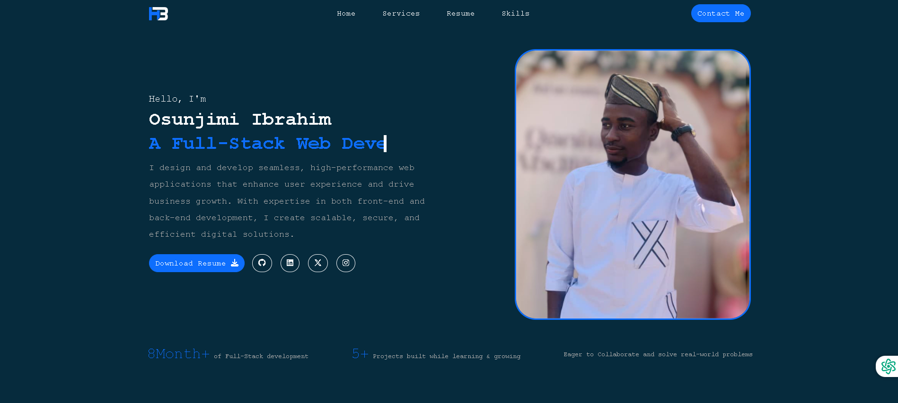

# My-PORTFOLIO-WITH-PHP 🚀

A professional portfolio website built with PHP and MySQL, featuring dynamic content management and contact form functionality.

## ✨ Features

- **Responsive Design**: Mobile-first approach with Bootstrap
- **Dynamic Content**: PHP-powered sections with AOS animations
- **Contact Form**: WhatsApp integration and MySQL storage
- **Form Validation**: Server-side validation with error handling
